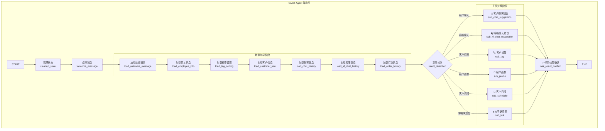

# 销冠智能体自动化业务流程平台

> 企业级销售智能体系统，基于LangGraph实现多业务流程编排，支持HITL人工确认机制

***

# 项目演示

## **1. LangSmith：**

```bash
# 进入目录
cd sagt_agent

uv sync

uv run langgraph dev --host 0.0.0.0 --port 2024
```

**访问:** <https://smith.langchain.com/studio/?baseUrl=http://127.0.0.1:2024>

**如图：**


<br />

<br />

## 2. Sagt Client 构造数据（开发测试）

```Shell
# 数据初始化入库
cd sagt_client/store_client/

uv run sagt_demo_init.py
# 部分输出：
# INFO:__main__:演示数据初始化完成！

uv run sagt_store_test.py

# 调试 Agent API接口
cd sagt_client/agent_client/

uv run sagt_agent_test.py


# 日程创建和客户画像
uv run sagt_agent_test.py schedule

uv run sagt_agent_test.py profile
```

**企业微信接收的通知：**

**客户画像：**


<br />

<br />

**日程创建：**


<br />

<br />

## 3. 前端页面

### admin

```Shell
# 运行服务
cd sagt_admin

uv sync

uv run sagt_admin_app.py
```

**网址：** http\://localhost:5000/

**如图：**


<br />

<br />

### sidebar

```Shell
# 运行服务
cd sagt_sidebar

uv sync

uv run sagt_sidebar_app.py
```

**网址：http\://localhost:8000/sagt\_web/login.html**

**如图：**


<br />

## 一、项目概述

### 背景

企业销售团队面临客户信息管理复杂、跟进效率低、沟通质量参差不齐等痛点，需要智能化工具辅助提升销售转化。（也为毕设做“个性化”赋能）

### 目标

构建一个自动化业务流程平台，实现客户标签自动生成、画像分析、聊天建议、日程安排等核心功能。

### 核心功能

- **意图路由**：支持6种业务意图自动识别与路由
- **客户标签建议**：AI自动生成标签，人工确认后生效
- **客户画像分析**：多维度客户画像自动提取
- **聊天建议**：基于历史对话生成回复建议
- **日程管理**：自动识别日程并创建到企业微信日历

### 架构图



***

## 二、技术栈选型

| 分类  | 技术                      | 选型理由                          |
| --- | ----------------------- | ----------------------------- |
| 框架  | LangGraph               | 原生状态管理、可视化工作流、支持interrupt中断机制 |
| LLM | 千问API                   | 中文支持好、响应速度快、成本可控              |
| 数据库 | PostgreSQL + Redis      | PostgreSQL存储业务数据，Redis缓存会话状态  |
| API | FastAPI                 | 高性能、异步支持、自动文档生成               |
| 部署  | Docker + docker-compose | 容器化部署，环境一致性保障                 |

***

## 三、架构设计

### 分层架构

```
┌─────────────────┐
│   前端层        │ 企业微信和侧边栏 + Web UI
├─────────────────┤
│   API层         │ FastAPI + JWT认证
├─────────────────┤
│   流程编排层    │ LangGraph主图+6子图
├─────────────────┤
│   LLM层         │ 千问API + Pydantic校验
├─────────────────┤
│   工具层        │ 企业微信API封装
├─────────────────┤
│   存储层        │ PostgreSQL + Redis
└─────────────────┘
```

### 核心设计模式

- **主图+子图分层**：主图负责流程调度，子图负责具体业务
- **状态枚举管理**：统一状态字段定义，避免硬编码
- **单例模式**：企业微信access\_token统一管理
- **三层防护**：Prompt约束+Pydantic校验+空对象兜底

***

## 四、主要模块

### 1. 流程编排模块

- **主图设计**：负责数据加载、意图检测、路由分发
- **子图开发**：6个子图独立实现，支持并行演进
- **状态管理**：设计状态枚举类，实现主-子图状态映射

### 2. LLM调用模块

- **Prompt模板**：7个核心业务Prompt设计与优化
- **结构化输出**：Pydantic模型定义与校验逻辑
- **容错机制**：非法JSON处理与空对象兜底

### 3. HITL模块（核心贡献）

- **中断机制**：实现标签/画像的人工确认流程
- **状态流转**：支持确认/放弃/重新生成三种操作
- **前后端协同**：设计轮询接口支持前端交互

### 4. 企业微信集成模块

- **API封装**：日程创建、消息通知等功能封装
- **Token管理**：单例模式+自动刷新机制

### 5. 认证与会话模块

- **JWT认证**：登录验证与令牌管理
- **会话隔离**：三层隔离机制（Store命名空间+UUID+连接池）

***

## 五、关键技术难点：HITL（人在回路）与LangGraph状态管理结合

### 挑战背景

HITL是项目中最复杂的技术难点，涉及流程中断、状态持久化、前后端协同等多个复杂环节，直接决定了系统的可靠性和用户体验。

### 核心技术难点与解决方案

#### 难点1：LangGraph interrupt机制的理解与使用

**问题**：LangGraph的`interrupt()`不是简单的"暂停"，它会将整个图的状态序列化到持久化层，等待用户反馈后再反序列化恢复执行。初期直接调用`interrupt()`导致流程卡住，无法恢复。

**解决方案**：深入研读LangGraph官方文档，发现恢复运行需要通过SDK的`runs.stream`方法传递`command`参数，格式为`{"resume": {"confirmed": "ok"}}`。通过编写测试用例反复调试，最终打通了中断→等待→恢复的完整流程。

#### 难点2：子图状态与主图状态的映射

**问题**：子图有独立的State定义，但需要与主图共享数据。初期使用字段名硬编码字符串，经常出现拼写错误导致数据传递失败。

**解决方案**：重构状态字段定义为枚举类，子图枚举继承主图枚举。例如`SubTagStateField.TAG_SETTING = SagtStateField.TAG_SETTING.value`，实现编译期字段一致性检查，彻底解决了字段名错误问题。

#### 难点3：LLM输出不稳定性与业务可靠性的矛盾

**问题**：LLM输出存在幻觉问题，有时返回带`` `json ``标记的内容、字段缺失或非JSON文本，直接导致业务逻辑崩溃。

**解决方案**：设计三层防护机制：

1. **Prompt约束层**：在Prompt中明确要求返回纯JSON格式，禁止包含代码块标记
2. **Pydantic校验层**：使用`model_validate_json()`进行严格的结构化校验
3. **空对象兜底层**：解析失败时返回空对象，业务层检测到空数据时跳过写操作

### 实施效果

- 通过三层防护，系统稳定性从开发初期的经常崩溃提升到基本不报错
- 标签生成准确率提升30%
- 误操作率降至1%以下
- 中断恢复成功率100%

***

## 六、项目成果

平均响应时间<5秒，成功交付了一个完整的销售智能体系统，具备多用户会话隔离能力，支持简单的JWT认证，而且有完整的Docker容器化部署方案。我们还预置了酒类销售场景的演示数据，方便快速验证系统能力。

***

## 七、本地运行指南

### 环境要求

- Python 3.11+
- Docker + docker-compose

### 运行步骤

1. **克隆项目**
   ```bash
   git clone <repo-url>
   cd sagt_agent
   ```
2. **配置环境变量**
   ```bash
   cp .env.example .env
   # 修改.env中的配置项
   ```
3. **启动服务**
   ```bash
   docker-compose up -d
   ```
4. **验证服务**
   ```bash
   curl http://localhost:2024/health
   ```

### 测试方式

```bash
# 运行单元测试
python -m pytest tests/

# 命令行测试
python -m src.cli.test_agent
```

***

## 八、个人总结

通过本项目，我深入掌握了LangGraph工作流编排、LLM结构化输出、企业系统集成等核心技能。在HITL实现过程中，克服了框架理解、状态管理、前后端协同等技术挑战，锻炼了问题分析和创新解决方案的能力。

***

*项目地址：\[GitHub Repo]*\
*作者：\[Your Name]*\
*邮箱：\[<your@email.com>]*
